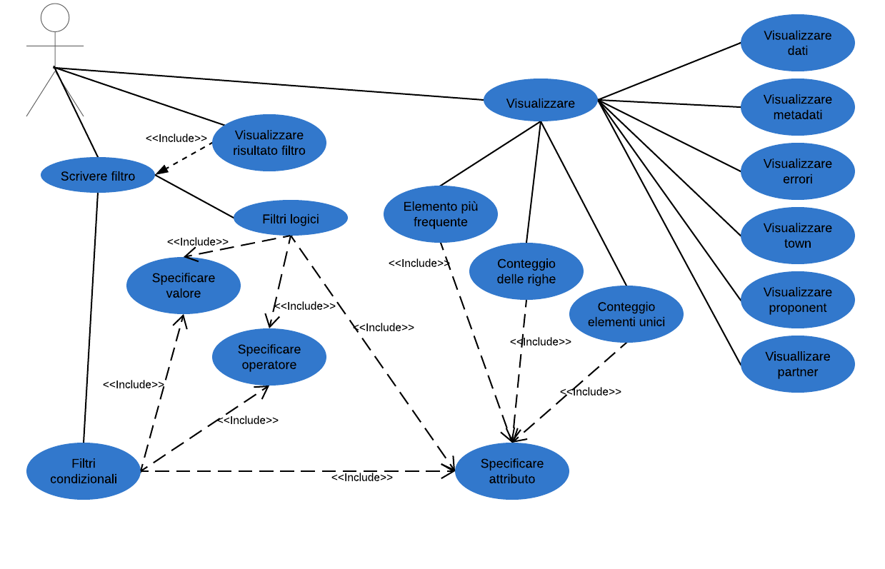
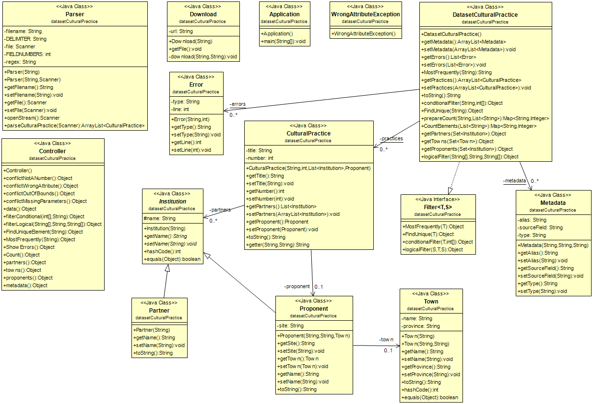
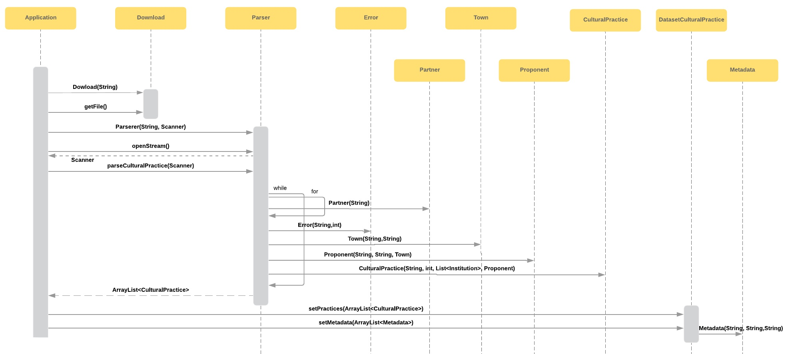
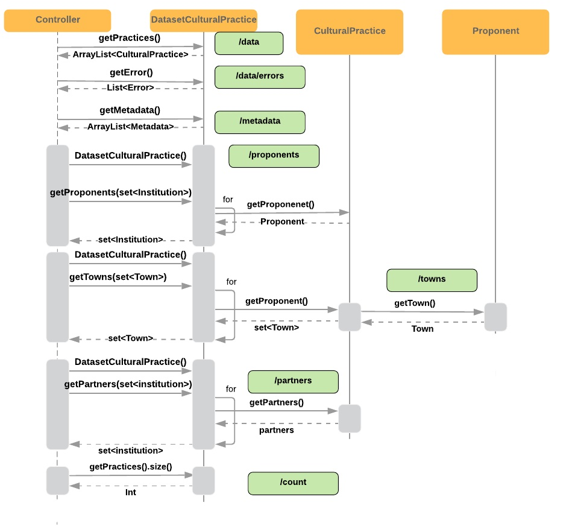
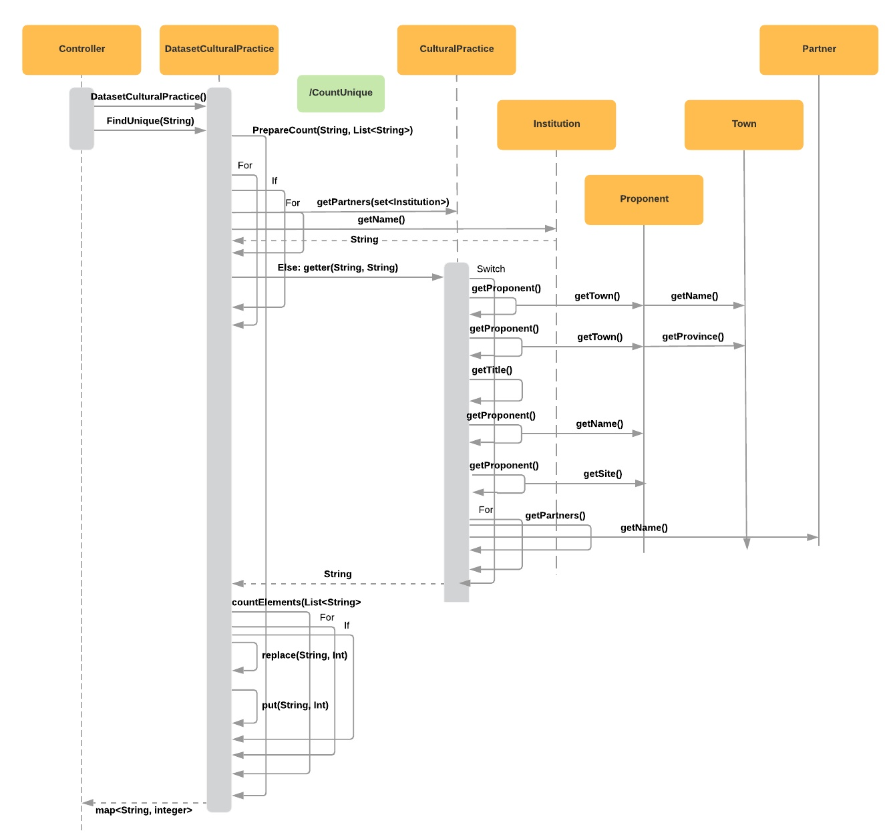
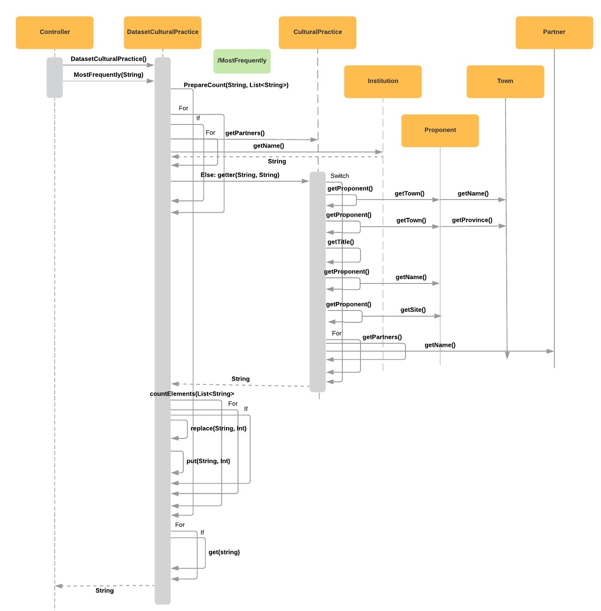
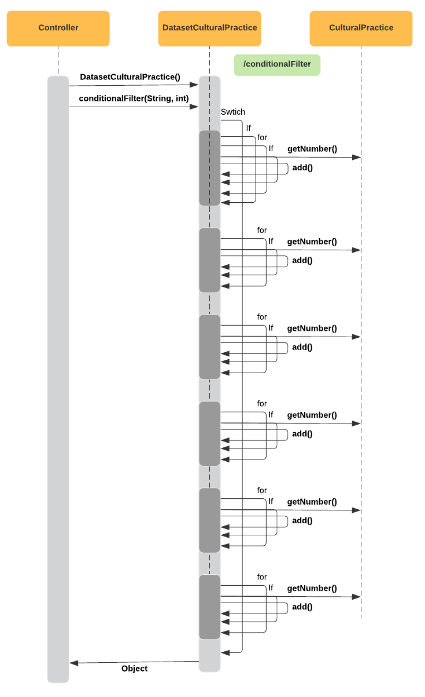
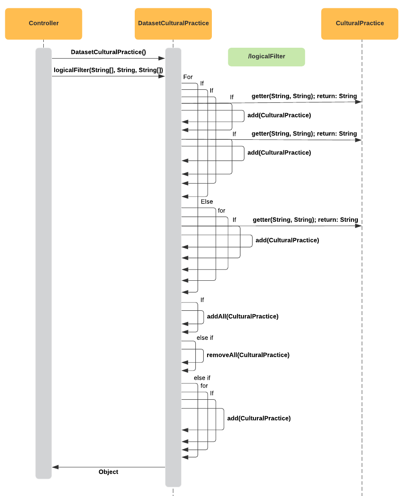

# ProgettoProgrammazioneOggetti
Progetto Programmazione ad oggetti Giuseppe Costantini Davide Vitaletti appello Giugno AA 2018/2019

## Descrizione

L'applicazione realizzata permette all'utente di effetturare interrogazioni su un dataset dato. In particolare, all'avvio, verrà scaricato
il file JSON che contiene l'URL attraverso cui accedere al dataset in formato CSV. Nel nostro caso, il dataset riguardava un catalogo di
buone pratiche culturali nella regione Lazio. L'applicazione, dopo aver salvato questo file nella cartella apposita, effettua il parsing 
dei dati, creando gli oggetti delle classi scritte in JAVA. In modo specifico, per ogni riga vengono salvate le informazioni del titolo 
della pratica culturale, il numero ad essa associato, l'ente proponente, il sito internet di questo, la provincia, il comune e la lista 
degli enti partner. Se durante il parsing ci dovesse essere un errore di formattazione su una riga, il codice salva il tipo di errore e
passa alla riga successiva. 

Terminata questa fase, l'utente può effettuare delle richieste sul dataset utilizzando Postman. Le interrogazioni sono state implementate tramite API di tipo REST. innanzitutto, l'utente può visualizzare tutti i dati attraverso la richiesta "/data". Invece, scrivendo "/metadata", verranno visualizzati i metadati relativi agli attributi del dataset. Di seguito, attraverso la richiesta "/countUnique" e specificando un attributo, è possibile visualizzare per ogni elemento di quell'attributo quante volte è ripetuto all'interno del dataset. Scrivendo "/mostFrequently" e specificando un attributo, invece, verrà visuallizato l'elemento, dell'attributo specificato, più volte presente nel dataset. Di seguito, con la funzione "/data/errors", verranno visualizzati tutti gli errori di formattazione presenti. Con "/count", invece, verrà restituito il numero di righe valide. Con la richiesta "partners", l'utente può visualizzare la lista di tutti i partner presenti nel database, senza ripetizionioni fra di essi. Lo stesso per le città e per gli enti proponenti scrivendo, rispettivamente, "/towns" e "proponents". 

Infine, l'utente può effetturare 2 richieste con i filtri e sono le seguenti:
1) "/conditionalFilter": tramite questa scrittura, l'utente può effettuare un filtro sull'attributo numero. In particolare, ha la possibilità di inserire un'operatore ">= ; > ; < ; <= ; =><= " e uno o più numeri (solo nel caso di "=><=" che indica la condizione "compreso"). Verrà restituita, dunque, una lista di pratiche culturali filtrata sull'attributo numero. 
2) "logical/Filter": tramite questa funzione, l'utente può specificare uno o più attributi, operatori e valori. Gli operatori possono essere "or ; and ; in ; nin", mentre i valori sono scelti dall'utente. Al termine della scrittura, verrà restituita una lista di pratiche culturali filtrate. Come esempio, l'utente può cercare le pratiche culturali in cui l'ente proponente contiene almeno una lettera "c" nel nome e che la provincia sia RM. 

## Diagramma dei casi d'uso

## Diagramma delle classi

## Diagramma delle sequenze

Per quanto riguarda il diagramma delle sequenze, abbiamo deciso di dividere in diagramma in più schemi, ognuno rappresentante una funzione dell'applicazione implementata. In particolare i diagrammi rappresentano rispettivamente: l'avvio dell'applicazione, le richieste di get di base, la richiesta CountUnique, la richiesta MostFrequently, la richiesta ConditionalFilter, la richiesta LogicalFilter.

